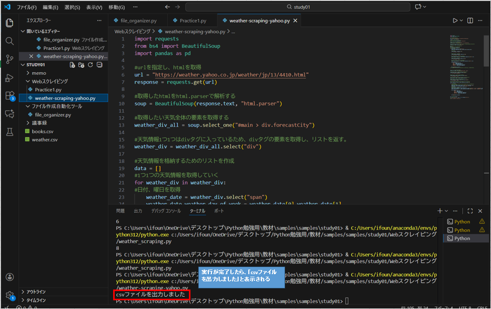
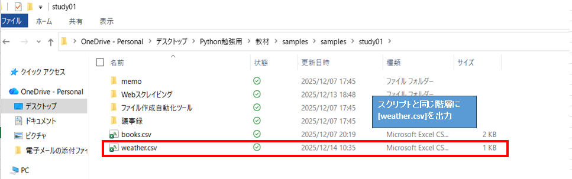
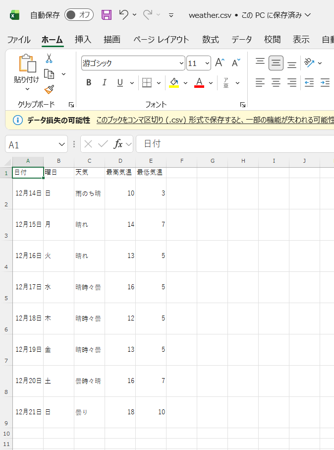
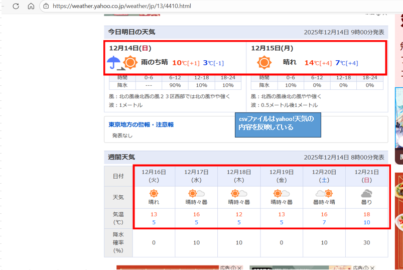

# Yahoo天気スクレイピングツール ☀️🌧️  
Yahoo!天気から東京都の1週間分の天気情報（日時・天気・最高/最低気温）をスクレイピングし、CSV形式で保存するPythonツールです。

## 概要
このツールは以下を自動で行います：

- Yahoo!天気（HTML）から1週間の天気情報を抽出します
- BeautifulSoup で必要な要素を解析します
- 日付・曜日・天気・最高気温・最低気温を1行ごとに記録します
- 実行すると、スクリプトと同一階層（カレントディレクトリ）に `weather.csv` を出力します
  ※GitHub リポジトリ内には、サンプルとして `data/weather.csv` を配置しています。
- 構造化データとして再利用可能

スクレイピング学習・ポートフォリオ作品として設計しています。

## デモ
### 実行画面(VS Code)
　　
   
   
### 実行画面(csvファイル出力)
   　
   　
  
## 使い方
### 1. リポジトリをクローン
```bash
git clone https://github.com/jt19951014-maker/weather-scraping-yahoo.git
cd weather-scraping-yahoo
```

### 2. 必要なライブラリをインストール
```bash
pip install -r requirements.txt
```

### 3. スクリプトを実行
```bash
python src/weather_scraping.py
```

実行すると、スクリプトを実行したディレクトリに
weather.csv が出力されます。

## 特徴
```bash
・APIを使用せず、HTMLを直接解析するスクレイピング
・class の複数指定や br タグを考慮したHTML解析
・日付と曜日の抽出
・最高気温・最低気温の抽出
・pandas を使用したCSV出力
```

## 使用技術
```bash
・Python 3.12
・requests
・beautifulsoup4
・pandas
```

## 構成
```bash
weather-scraping-yahoo/
├─ src/
│   └─ weather_scraping.py
├─ data/
│   └─ weather.csv
├─ requirements.txt
├─ README.md
└─ .gitignore
```

## 今後の拡張予定
```bash
・他地域への対応（URLのパラメータ化）
・天気データの可視化（グラフ表示）
・平均気温・気温差の計算
・エラーハンドリングの強化
・Webアプリ化
```

## License
MIT License
